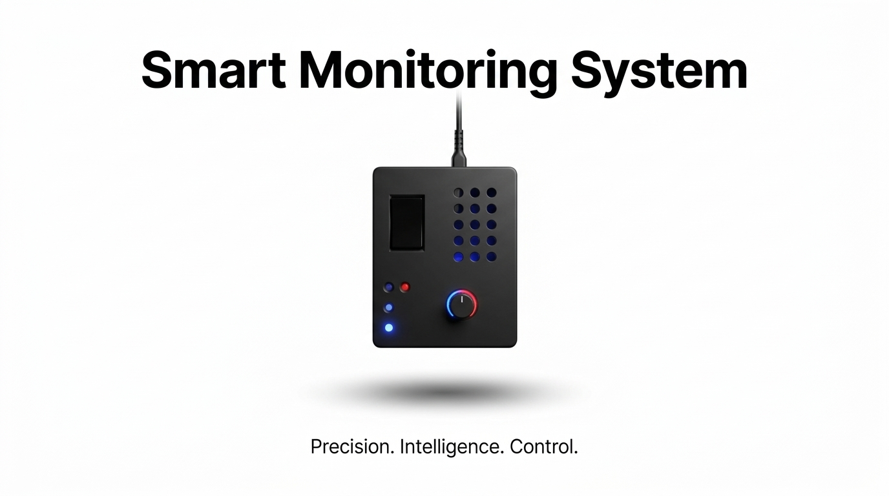
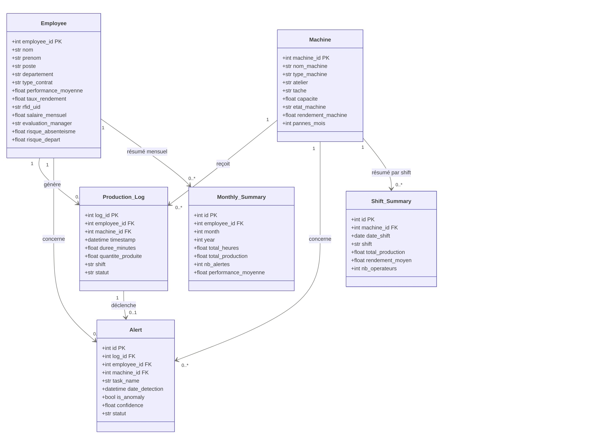
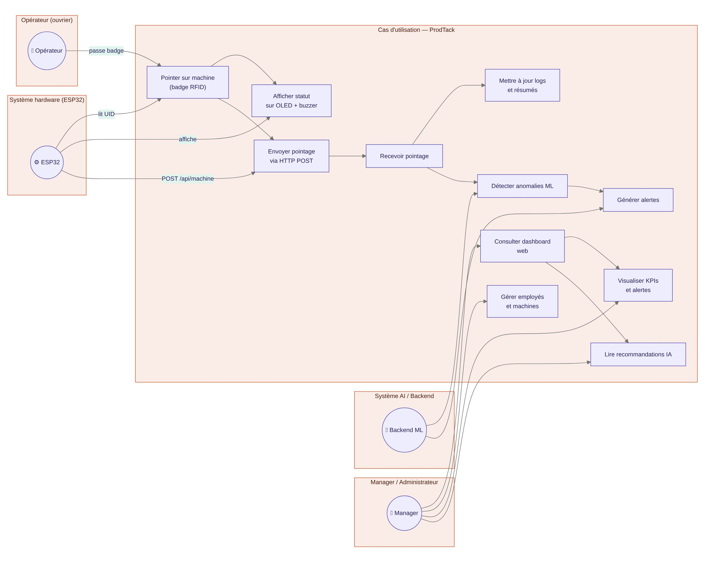

<div align="center">

<br/>


# ⚡ ProdTack

### Système intelligent de suivi de production IoT × Machine Learning × AI Agent × Web

<br/>


<!-- Bannière principale -->

<br/>

> *Un atelier textile connecté de A à Z — du badge RFID sur la machine jusqu'au tableau de bord intelligent du manager, avec une IA qui détecte les anomalies, prédit les rendements futurs et génère des rapports automatiquement.*

<br/>


</div>

[Présentation](#-quest-ce-que-prodtack) · [Fonctionnalités](#-fonctionnalités-complètes) · [Architecture](#-architecture-du-système) · [Modèle ML](#-machine-learning) · [Agent IA](#-agent-ia--assistant-rapports) · [Équipe](#-équipe)

---

</div>

## 🧠 Qu'est-ce que ProdTack ?

**ProdTack** est un système de supervision industrielle complet, conçu pour les **ateliers textiles**. Il connecte le terrain (machines, opérateurs) à la direction (managers, rapports) en passant par une couche intelligente de Machine Learning et d'IA générative.

Le projet fusionne **quatre domaines** en un seul pipeline cohérent :

- 🔧 **IoT Hardware** — des ESP32 avec lecteurs RFID, écrans OLED et buzzers, fixés sur chaque machine de l'atelier
- ⚙️ **Backend robuste** — une API FastAPI qui orchestre les données, les règles métier et les modèles ML
- 🤖 **Intelligence artificielle** — détection d'anomalies, prédiction de rendement futur, et un agent conversationnel pour l'aide à la décision
- 🖥️ **Dashboard web moderne** — une interface Next.js donnant aux managers une vue complète, en temps réel, sur leurs équipes et machines

---

## ✨ Fonctionnalités complètes

### 🔴 Terrain — Dispositif IoT (ESP32)

| Fonctionnalité | Description |
|----------------|-------------|
| **Pointage RFID** | L'opérateur badge sur le lecteur RC522 fixé à sa machine |
| **Retour OLED** | Affichage instantané du nom de l'opérateur, de la machine et du statut |
| **Confirmation buzzer** | Signal sonore à chaque pointage validé ou refusé |
| **Transmission Wi-Fi** | Envoi automatique via HTTP POST vers le backend (UID + machine + timestamp) |
| **Fonctionnement autonome** | L'ESP32 fonctionne indépendamment — pas besoin d'un PC sur le terrain |

---

### 🟡 Backend — API & Données (FastAPI + SQLite)

| Fonctionnalité | Description |
|----------------|-------------|
| **Enregistrement des pointages** | Chaque passage de badge crée un `Production_Log` horodaté |
| **Gestion des employés** | Profils complets : poste, département, RFID UID, type de contrat, salaire |
| **Gestion des machines** | État, rendement, type, atelier, historique de pannes par mois |
| **Résumés par shift** | Agrégation automatique des logs en `Shift_Summary` par machine et par shift |
| **Résumés mensuels** | Synthèse mensuelle par employé : heures totales, production, alertes |
| **API REST documentée** | Documentation Swagger UI automatique via FastAPI |

---

### 🤖 Intelligence artificielle — Machine Learning

| Fonctionnalité | Description |
|----------------|-------------|
| **Détection d'anomalies en temps réel** | Chaque nouveau log est analysé par le modèle Isolation Forest dès sa création |
| **Score de confiance** | Chaque anomalie est accompagnée d'un score de confiance pour prioriser les alertes |
| **Prédiction de rendement futur** | Le modèle prédit le rendement attendu des machines et des opérateurs pour les prochains shifts |
| **Tendances de production** | Identification des tendances à la hausse ou à la baisse par équipe, machine et atelier |
| **Indicateurs de risque employé** | Calcul automatique du risque d'absentéisme et du risque de départ pour chaque employé |
| **Modèle sérialisé** | Le modèle entraîné (`isolation_forest.pkl`) est prêt pour l'inférence sans réentraînement |

---

### 💬 Agent IA — Assistant Rapports & Recommandations

L'une des fonctionnalités les plus avancées de ProdTack est son **agent IA conversationnel**, intégré directement dans le dashboard.

| Fonctionnalité | Description |
|----------------|-------------|
| **Génération automatique de rapports** | Le manager peut demander en langage naturel : *"Génère le rapport de production de cette semaine"* — l'agent analyse les données et rédige le rapport complet |
| **Recommandations contextuelles** | L'agent analyse les alertes actives et les tendances pour proposer des actions correctives concrètes |
| **Résumés de shift intelligents** | Synthèse narrative automatique de chaque shift avec points d'attention identifiés |
| **Analyse comparative** | L'agent compare les performances actuelles aux périodes précédentes et explique les écarts |
| **Aide à la décision** | Questions-réponses sur l'état de l'atelier : *"Quelle machine a le plus de pannes ce mois ?"*, *"Qui sont les meilleurs opérateurs cette semaine ?"* |
| **Export de rapports** | Les rapports générés sont exportables en PDF ou partagés directement depuis le dashboard |

---

### 🟢 Dashboard Web — Interface Manager (Next.js)

| Fonctionnalité | Description |
|----------------|-------------|
| **KPIs temps réel** | Vue synthétique des indicateurs clés : production du jour, taux de rendement, alertes actives |
| **Gestion des employés** | Tableau complet avec performance, risques, évaluation manager, historique de production |
| **Suivi des machines** | État en temps réel de chaque machine — en marche, en panne, en maintenance |
| **Centre d'alertes** | Liste des anomalies ML avec statut (Nouvelle / Vue / Traitée) et niveau de priorité |
| **Prédictions affichées** | Visualisation des prévisions de rendement futur par machine et par équipe |
| **Rapport mensuel** | Vue agrégée mensuelle avec comparaisons et tendances |
| **Interface agent IA** | Chat intégré pour interroger le système et générer des rapports à la demande |

---
<div align="center">

## Diagrammes

### Cas d'utilisation


### Diagramme de classes


</div>

## 🏗 Architecture du système

```
╔══════════════════════════════════════════════════════════════════════╗
║                        COUCHE HARDWARE (Terrain)                     ║
║                                                                      ║
║   [Opérateur]  ──badge──▶  [ESP32 + RC522]  ──▶  OLED + Buzzer      ║
║                                   │                                  ║
╚═══════════════════════════════════╦════════════════════════════════╝
                                    │  HTTP POST /api/machine
                                    │  { rfid_uid, machine_id, timestamp }
                                    ▼
╔══════════════════════════════════════════════════════════════════════╗
║                        COUCHE BACKEND (Serveur)                      ║
║                                                                      ║
║   [FastAPI]                                                          ║
║      ├── Enregistre  ──▶  [Production_Log]  ──▶  [SQLite]           ║
║      ├── Agrège      ──▶  [Shift_Summary] + [Monthly_Summary]        ║
║      └── Analyse     ──▶  [Isolation Forest]                        ║
║                                  │                                   ║
║                     ┌────────────┴─────────────┐                    ║
║                     ▼                           ▼                    ║
║              [Anomalie détectée]       [Prédiction rendement]        ║
║              Création Alert            Prévision shifts futurs       ║
╚═══════════════════════════════════╦════════════════════════════════╝
                                    │  REST API (JSON)
                                    ▼
╔══════════════════════════════════════════════════════════════════════╗
║                        COUCHE FRONTEND (Dashboard)                   ║
║                                                                      ║
║   [Next.js 14 + React + TailwindCSS]                                 ║
║      ├── KPIs & alertes temps réel                                   ║
║      ├── Gestion employés & machines                                 ║
║      ├── Prédictions & tendances ML                                  ║
║      └── Agent IA (chat + génération de rapports)                   ║
╚══════════════════════════════════════════════════════════════════════╝
```

---

## 📊 Modèle de données

```
Employee ──────────────┐
                       ├──▶ Production_Log ──▶ Alert (ML)
Machine ───────────────┘         │
                                 ├──▶ Shift_Summary
                                 └──▶ Monthly_Summary
```

| Entité | Attributs clés |
|--------|----------------|
| `Employee` | employee_id, nom, rfid_uid, poste, performance_moyenne, taux_rendement, risque_absenteisme, risque_depart |
| `Machine` | machine_id, nom_machine, etat_machine, rendement_machine, pannes_mois, atelier |
| `Production_Log` | log_id, employee_id (FK), machine_id (FK), timestamp, duree_minutes, quantite_produite, shift |
| `Alert` | id, log_id (FK), is_anomaly, confidence, statut, date_detection |
| `Shift_Summary` | machine_id (FK), date_shift, shift, total_production, rendement_moyen |
| `Monthly_Summary` | employee_id (FK), month, year, total_heures, nb_alertes, performance_moyenne |

---

## 🤖 Machine Learning

### Détection d'anomalies — Isolation Forest

L'**Isolation Forest** est un algorithme non-supervisé qui identifie les observations anormales en les "isolant" plus rapidement que les données normales. Avantages pour notre contexte industriel :

- Pas besoin de données labellisées — les anomalies ne sont pas définies à l'avance
- Robuste sur des données multidimensionnelles (plusieurs métriques simultanées)
- Produit un score de confiance exploitable pour prioriser les alertes

```
Nouveau log créé
      │
      ▼
Extraction features : durée, quantité, rendement,
                      heure, pannes_mois, taux_rendement_employé
      │
      ▼
[isolation_forest.pkl]
      │
      ├── Score normal  ──▶  Log enregistré, aucune action
      └── Score anormal ──▶  Alert créée (confidence + statut "Nouvelle")
```

### Prédiction de rendement futur

Le module de prédiction analyse les historiques de `Production_Log` et `Shift_Summary` pour projeter :

- Le **rendement attendu** par machine sur les prochains shifts
- Les **risques de sous-performance** avant qu'ils ne surviennent
- Les **tendances** de productivité par opérateur et par atelier

---

## 💬 Agent IA — Assistant Rapports

L'agent IA est le cerveau décisionnel de ProdTack. Il s'appuie sur les données en base pour répondre aux managers en langage naturel et automatiser la création de rapports.

### Ce que l'agent peut faire

```
Manager : "Génère le rapport de production de cette semaine"
   │
   ▼
Agent IA
   ├── Interroge Production_Log (semaine en cours)
   ├── Récupère les Alerts actives
   ├── Compare avec Shift_Summary de la semaine précédente
   ├── Identifie les points d'attention
   └── Rédige un rapport structuré + recommandations
```

### Exemples de requêtes supportées

- *"Quelles machines ont des performances en baisse ce mois ?"*
- *"Génère un résumé du shift du matin pour l'atelier A"*
- *"Qui sont les opérateurs avec le risque de départ le plus élevé ?"*
- *"Compare la production de cette semaine avec la semaine dernière"*
- *"Y a-t-il des anomalies non traitées depuis plus de 24h ?"*

---

## 🛠 Stack technique

| Couche | Technologie |
|--------|-------------|
| **Hardware** | ESP32 · RFID RC522 · OLED SSD1306 · Buzzer · Wi-Fi |
| **Backend** | Python · FastAPI · SQLModel · Uvicorn |
| **Base de données** | SQLite |
| **Machine Learning** | scikit-learn · Isolation Forest · pandas · numpy |
| **Agent IA** | LLM intégré · Prompt engineering · Accès données contextuelles |
| **Frontend** | Next.js 14 · React · TailwindCSS |
| **Communication** | HTTP REST · JSON |

---

## 👥 Équipe

Ce projet a été conçu et développé par :

| Nom | École | Contribution |
|-----|-------|--------------|
| **Helmi Soudana** | ENISO | Architecture système · Backend · Machine Learning · Agent IA |
| **Hayder Testouri** | ENSI | Backend · Base de données · API REST · Modèle de données |
| **Ahmed Naoui** | ENISO | Hardware · ESP32 · Firmware RFID · Communication IoT |
| **Sirine Zaibi** | ENSIT | Frontend · Dashboard Next.js · UI/UX · Intégration API |

<br/>

> 📬 **Vous souhaitez en savoir plus, collaborer ou utiliser des éléments de ce projet ?**
> Contactez-nous **avant tout usage** — toute réutilisation est soumise à une autorisation écrite.
> Ouvrez une issue GitHub ou contactez directement l'un des membres de l'équipe.

---

## ⚖️ Licence & Protection

<div align="center">


</div>

**© 2025 Helmi Soudana, Hayder Testouri, Ahmed Naoui, Sirine Zaibi. Tous droits réservés.**

Ce dépôt est partagé à titre **consultatif et démonstratif uniquement**. Il est mis en ligne pour présenter nos compétences techniques et notre démarche de conception.

**Il est strictement interdit de :**
- Copier, reproduire ou distribuer tout ou partie du code source
- Réutiliser l'architecture, les algorithmes, les modèles ML ou les designs sans autorisation écrite
- Présenter ce travail comme le sien, partiellement ou intégralement
- Utiliser ce projet dans un cadre commercial, académique ou personnel sans accord explicite de l'équipe

**Toute demande légitime (inspiration, citation, collaboration) doit être soumise via une issue GitHub avant tout usage.**

---

<div align="center">

*ProdTack — Conçu avec rigueur. Partagé avec fierté.*

</div>